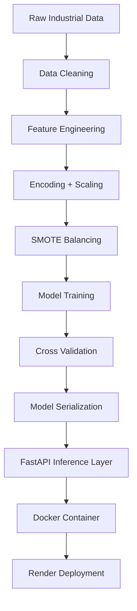

# Predictive Maintenance ML System (End-to-End Pipeline + API + Docker Deployment)


## Overview

This project implements a complete end-to-end machine learning system for predictive maintenance in industrial environments.

It combines:
- Data preprocessing & feature engineering
- Imbalanced learning handling (SMOTE)
- Binary + multi-class classification
- Model evaluation & validation
- Production-ready REST API (FastAPI)
- Docker containerization
- CI/CD-ready structure (GitHub Actions compatible)

The system predicts:
1. Whether a machine will fail (binary classification)
2. Type of failure (multi-class classification)


## Architecture Overview




## FastAPI Service

### Endpoint Design (Improved)

- **Endpoint**: `/predict`
- **Method**: `POST`
- **Content-Type**: `application/json`

### Design Improvements
✔ Clean input schema validation (Pydantic)
✔ Structured response format
✔ Production-ready scalability
✔ Input validation & error handling


## Request & Response Examples

### Example 1

```json
{
  "features": [1, 298.4, 308.2, 1282, 60.7, 216]
}
```

```json
{
  "failure": true,
  "type": "Overstrain Failure"
}
```


### Example 2

```json
{
  "features": [1, 298.4, 308.2, 1282, 60.7, 100]
}
```

```json
{
  "failure": false
}
```


### Example 3

```json
{
  "features": [1, 295, 400, 770, 70, 216]
}
```

```json
{
  "failure": true,
  "type": "Power Failure"
}
```


## API Usage (cURL)

### Local
```bash
curl -X POST "http://127.0.0.1:10000/predict" \
-H "Content-Type: application/json" \
-d '{"features": [1, 298.4, 308.2, 1282, 60.7, 216]}'
```

### Production (Render)
```bash
curl -X POST "https://predictive-maintenance-ml-system.onrender.com/predict" \
-H "Content-Type: application/json" \
-d '{"features": [1, 298.4, 308.2, 1282, 60.7, 216]}'
```


## Docker Setup

### Build Image
```bash
docker build -t predictive-maintenance-api .
```

### Run Container (Local)
```bash
docker run -p 10000:10000 predictive-maintenance-api
```

### Docker Compose
```bash
docker compose up --build
```


## Access API

### Local
- Swagger UI: http://127.0.0.1:10000/docs

### Production (Render)
- API: https://predictive-maintenance-ml-system.onrender.com
- Docs: https://predictive-maintenance-ml-system.onrender.com/docs


## Deployment Strategy

- Render (Docker deployment)
- GitHub (source control)
- CI/CD ready (GitHub Actions compatible)


## CI/CD Ready Design

✔ Auto build on push
✔ Docker-based deployment
✔ Ready for future testing pipeline extension


## Business Value

- Predict machine failures early
- Reduce downtime costs
- Improve industrial efficiency
- Enable predictive maintenance strategies


## Contact

Email: dhiasomai@gmail.com  
LinkedIn: https://www.linkedin.com/in/dhia-somai-


## Notes

- Local runs on port 10000
- Production uses dynamic Render port ($PORT)
- FastAPI ensures scalable inference layer

